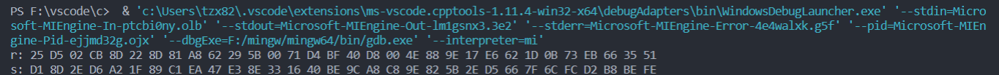

# 成员及账号名

唐战希 Tzx-cloud
[库链接](https://github.com/Tzx-cloud/homework.git)
# 项目简介

通过C++语言，我实现了SM2,SM3,SM4以及比特币和以太坊的大部分实验
具体项目为：

- SM2
    - ECDSA在以太坊上的应用报告(pdf)
    - SM2两方签名(C++)
    - 用RFC6979修改SM2(C++)
    - 谷歌密钥检查(C++)
- SM3
    - 生日碰撞攻击(C++)
    - ρ碰撞(C++)
    - 长度拓展攻击(C++)
    - 加速SM3(C++)
    - merkle tree(C++)
- SM4
    - 加速SM4(C++)
- 比特币
    - 比特币测试(pdf)
    - 伪造签名(C++)
- 以太坊
    - 对MPT的研究(txt)

# 项目说明
## 运行指导
> C++编译器为linux-64下的g++编译器
> 
> 对于同一个文件夹下的文件应使用多文件编译
> 
> 运行某一个project时，应注意把同文件夹下的其他文件中的main函数注释掉
## SM2
### SM2两方签名
在这个cpp文件中我构建了两个结构体，一个为Bob，一个为Alice来模拟签名的两方,最后Bob会生成一个签名(r,s).

### 用RFC6979修改SM2
首先我利用OpenSSL库中的椭圆曲线实现了基本的SM2算法，然后将生成随机数的方式用RFC6979方式代替，代码如下：
~~~C++
 //生成k RFC6979：k = SHA256(d + HASH(m));
 //这里为了方便，使用SM3代替SHA256
 openssl_sm3_hash(Z,(unsigned char*)M,strlen(M));
 memcpy(Buff+32,Z,32);
 BN_bn2binpad(d_a,Z,32);
 memcpy(Buff,Z,32);
 openssl_sm3_hash(Buff,Z,64);
 BN_bin2bn(Z,32,k);
~~~
最后成功生成了签名

### 谷歌密钥检查
通过模拟谷歌的用户名及密钥检查方式，来实现一个简单的密钥泄漏检查方法，同样我构建了一个client结构体和一个server结构体，最终检验是否泄漏由client完成。

## SM3
### 生日碰撞攻击
通过生日碰撞SM3，我利用维护一个哈希表的方法判断是否发生了碰撞。
最终实现了能够以很快的速度找到一个前6byte的碰撞，计算复杂度O(2^24)
得到的碰撞为：(long long)14597247,11626183
其哈希值前6byte都为0x89,0xc7,0xb7,0x67,0x1c,0x55.

### ρ碰撞
ρ碰撞相当于一对快慢指针，一个每次hash一遍，一个每次hash两次，由于会存在环路
这两个指针的值最终会相等，此时就是一次碰撞。
最终找到了一个前4byte的碰撞，计算复杂度O(2^16)

输入值为:1a,5c,57,08,46,68,f8,ff,d7,7d,7f,8c,29,38,a5,89,5f,df,d3,b0,31,6b,f7,ab,53,07,5e,94,be,3f,8f,70和
42,56,2c,6b,fd,94,14,5d,b5,a6,93,9e,52,29,02,18,04,96,04,3b,4b,88,f6,ee,49,25,52,05,bc,09,d9,7d。
hash前4byte为90,81,b4,37.

### 长度拓展攻击
长度拓展攻击是通过已知消息的长度来伪造hash计算时最后填充的一块，然后就可以在其后拓展自己想加入的消息。最后自己算出来的hash值与实际的hash值相同即为成功。


### 加速SM3
我通过SIMD指令集以及循环展开的方法，成功加速了SM3算法，最终与OpenSSL库对比可以发现加速了50%左右。

### merkle tree
在merkle tree中，我用SM3算法替换掉了原来的SHA256算法，然后创建了100,000个叶子节点，相邻节点的数值间隔1，然后由下至上构建一个hash树，因为我是依据RFC6962标准来构建树，一次不用考虑某一层节点为奇数的情况。对于存在性证明，需要至下而上计算hash，最终的hash值与根节点相同则证明成功，对于不存在性证明，只需要对两个相邻的节点进行存在性证明即可。
```C++
 int ret=inclusion_proof(node+3);//对第四个叶子节点的存在性证明,存在则返回0
     ret=exclusion_proof(3.2,node);//对3.2的不存在性证明，不存在返回0
```
## SM4
### 加速SM4
我通过预计算S盒生成4个8X32的表、SIMD指令集并行计算以及多线程并行加速的方式
成功对SM4算法完成了加速，将原始的加密速度0.000055clock/byte,最终提升到了
0.000006 clock/byte,加速了接近10倍，效果明显。
4@W$OM~90P8KD.png "结果截图")
## 比特币
#### 伪造签名
由于没有找到中本聪的签名及公钥，我自己随机生成一个公钥及签名，然后进行伪造，最后检验伪造的签名是否能够通过验证。
~~~C++
 sign res=make_sign();
 int ret=verify(res);//ret==0,correct sig
 sign forg=forge(res);
 ret=verify(forg);//ret==0,correct forge
~~~
